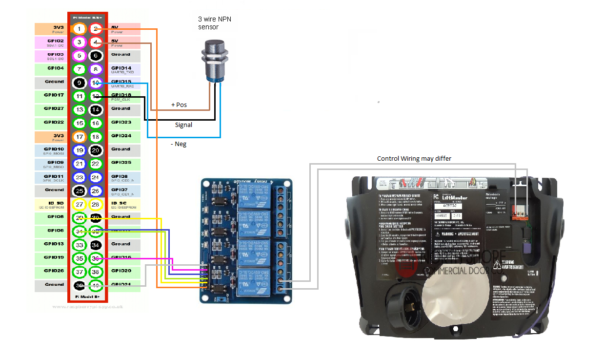

# garage-door  

## Dependencies:

- elcipse-mosquitto (mqtt) server

  - Standard
    -  https://mosquitto.org/download/
  - Docker
    - https://hub.docker.com/_/eclipse-mosquitto/

- ###### pi-mqtt-gpio  

  - https://github.com/flyte/pi-mqtt-gpio 
  - pip install pi-mqtt-gpio

## How To:

**MQTT - Docker:**

1. On any linux server running Docker
2. sudo su -
3. docker run -dit -p 1883:1883 -p 9001:9001 --name=mqtt --restart=always -v /mosquitto/config:/mqtt/config:ro -v /mosquitto/data:/mqtt/data -v /mosquitto/log:/mqtt/log eclipse-mosquitto

**MQTT - Standard:**

1. follow instuctions for your linux distro [here](https://mosquitto.org/download/)

**PI-MQTT-GPIO:**

1. on raspberrypi
2. sudo su -
3. pip install pi-mqtt-gpio
4. copy gpio_mqtt.service to "/etc/systemd/system/"
5. copy mqtt_config.yaml to "/home/pi/"
6. update GPIO pins, mqtt.host
   1. if wanted/needed mqtt.change topic_prefix, and/or digital_inputs/outputs values
7. run "systemctl enable gpio_mqtt.service"
8. run "systemctl start gpio_mqtt.service"

